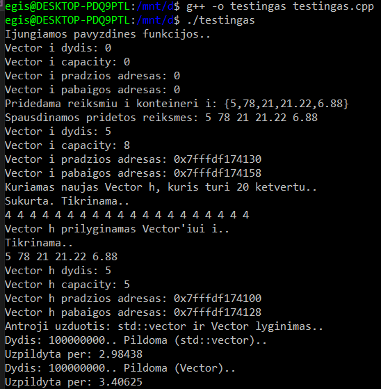
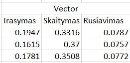
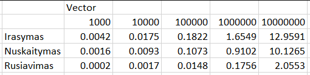

# Vector ir std::vector

# Rezultatai:
   
 
 Panaudotos funkcijos: `size()` , `capacity()` , `push_back()` , `begin()` , `end()`  
 
 Palyginta std::vector ir Vector spartos. Jos ,kaip matoma, yra vienodos.  
 
 Palyginta std::vector ir Vector duomenų perskisrtymai su 10000000 duomenų. Kaip matome nuotraukoje, jie nesiskiria.
 
 Studentų rezultatų darbui (https://github.com/3gis/Objektiniouzduotis/tree/V2.0) pritaikytas Vector. Spartos analize:
 
   
 std::vector (paimta iš https://github.com/3gis/Objektiniouzduotis/tree/V2.0):  
   
 
 
 
 
