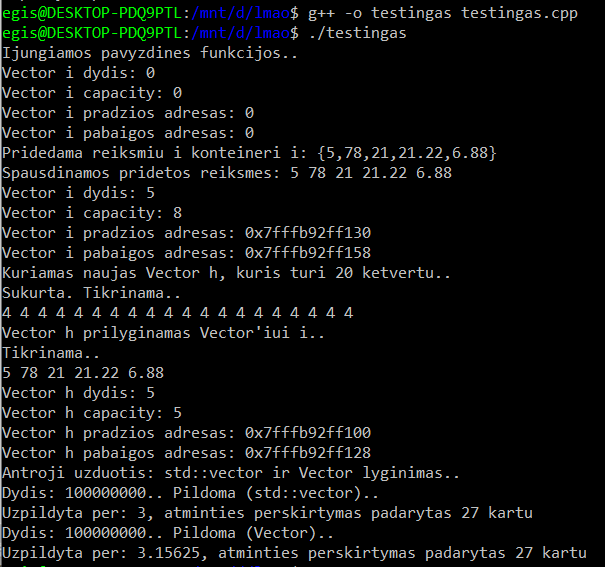

# Vector ir std::vector

# Rezultatai:
   
 
 Panaudotos funkcijos: `size()` , `capacity()` , `push_back()` , `begin()` , `end()`  
 
 Palyginta std::vector ir Vector spartos. Jos ,kaip matoma, yra vienodos.  
 
 Palyginta std::vector ir Vector duomenų perskisrtymai su 100000000 duomenų. Kaip matome nuotraukoje, jie nesiskiria.
 
 Studentų rezultatų darbui (https://github.com/3gis/Objektiniouzduotis/tree/V2.0) pritaikytas Vector. Spartos analize:
 
   
 std::vector (paimta iš https://github.com/3gis/Objektiniouzduotis/tree/V2.0):  
   
 
 Sparta su 100000 studentų taip pat labai panaši.
 
 # Naudojimo instrukcija (UNIX):
 *Jeigu norite paleisti Studentu sąrašą*
- 1: Failai yra Source aplankale. Vektoriai Source/vector Deque Source/deque List Source/list
- 2: Atsisiuskite bent vieną iš jų.
- 3: Konsolėje, įėję į programos aplankalą, parašykite `make` ir `./main`
- 4: Baigus naudoti parasykite `make clean`
*Jeigu norite paleisti testingas.cpp*:
- 1: `g++ -o testingas testingas.cpp`
- 2: `./testingas

 
 
 
 
